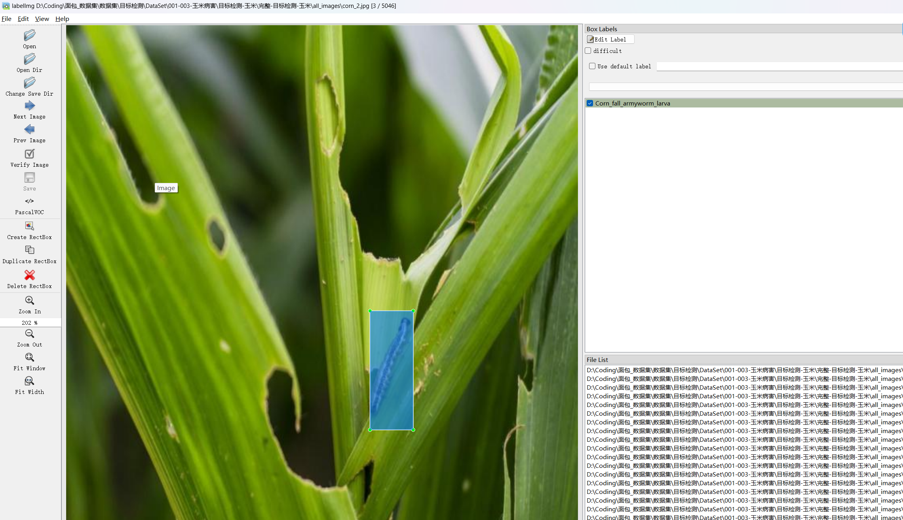

# Corn Leaf Disease Detection Dataset

Dataset Information: This dataset consists of 5046 images and correspondingly labeled files. The labeled files are in two formats: VOC formatted as xml files, and YOLO formatted as txt files. The objects of interest include the following:
- Corn_fall_armyworm_larva
- Corn_yellow_stem_borer_larvat
- Corn_yellow_stem_borer
- Corn_maize_streak_disease
- Corn_rust_leaf
- Corn_gray_leaf_spot
- Corn_blight
- Corn_leaf_Blight

The number of bounding box annotations for each object is as follows:
- Corn_fall_armyworm_larva: 765 (Corn field armyworm larvae)
- Corn_yellow_stem_borer_larva: 490 (Corn yellow stem borer larvae)
- Corn_yellow_stem_borer: 673 (Corn yellow stem borer)
- Corn_maize_streak_disease: 476 (Corn stripe disease)
- Corn_rust_leaf: 577 (Corn rust leaf)
- Corn_gray_leaf_spot: 570 (Corn gray leaf spot)
- Corn_blight: 722 (Corn blight)
- Corn_leaf_Blight: 5010 (Corn leaf blight)

Note: An image may contain multiple objects, so the total number of bounding boxes may exceed the number of images.
The complete dataset consists of three folders and one txt file:
- all_images folder contains the images of the dataset, screenshots included:
- Image sizes information:
- all_txt folder and classes.txt: store yolo formatted txt annotations, the number of annotations is the same as the number of images, each annotation file corresponds to an image.
- classes.txt:
- To understand the standard format of yolo formatted files, please search for it on your own by searching "yolo format" on Baidu. In short, the index 0 represents the name at index 0 in the array in classes.txt.
- all_xml folder: VOC formatted xml annotation files.
- The number and image size is the same as the annotation files, each annotation file corresponds to an image.
- To understand the standard format of VOC formatted files, please search for it on your own by searching "VOC format" on Baidu.

Both formats of annotations can be used, choose whichever one you prefer.
Annotation effect screenshots:

## Images

Here is a pay link on Stripe ( https://buy.stripe.com/3cs8yP7sY87d0vu9AB ). Please contact me lonlonago@foxmail.com after funding $89, and I will send you a complete data files , thank you!

